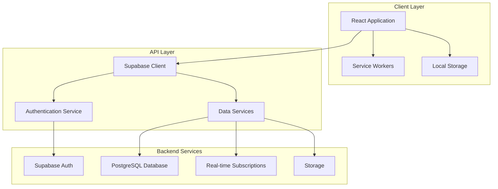
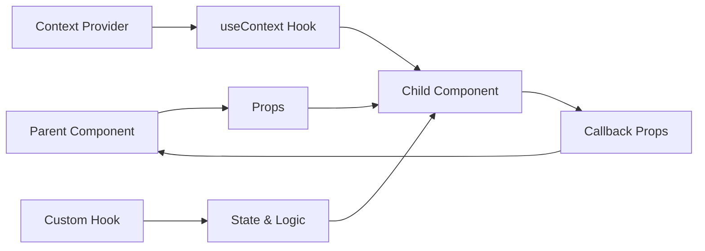
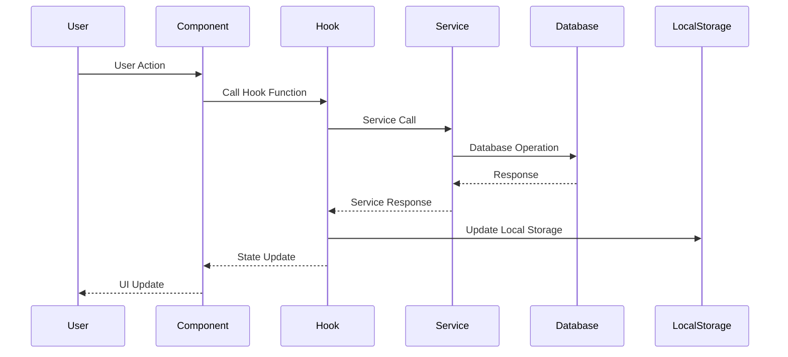
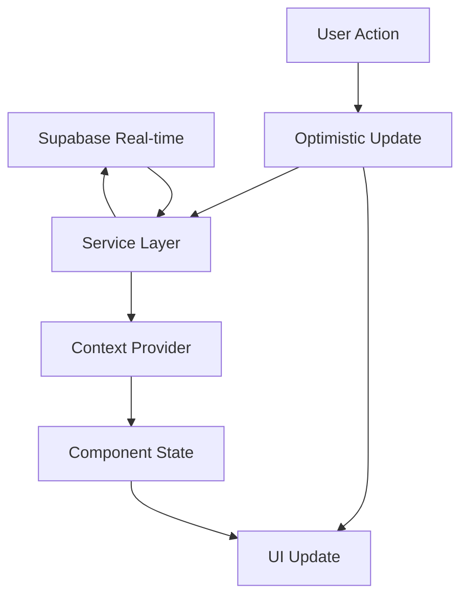
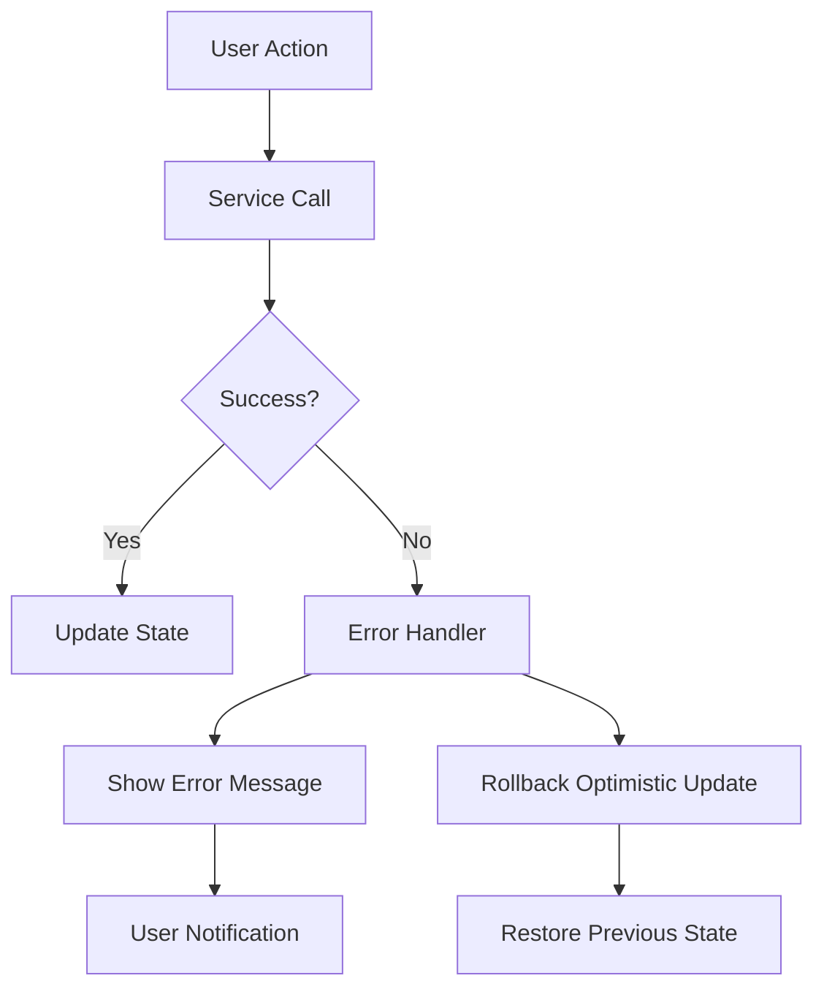
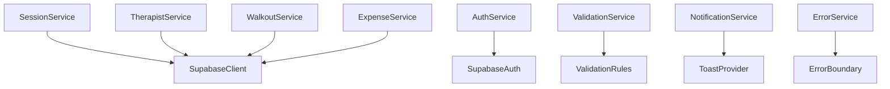
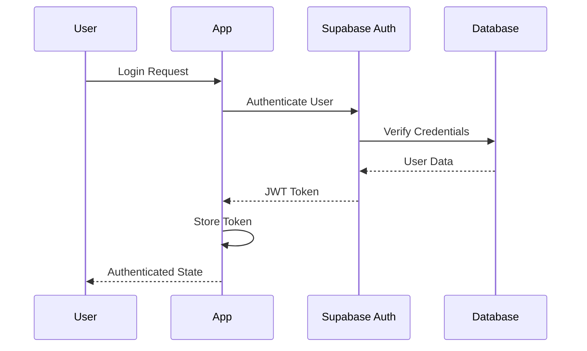
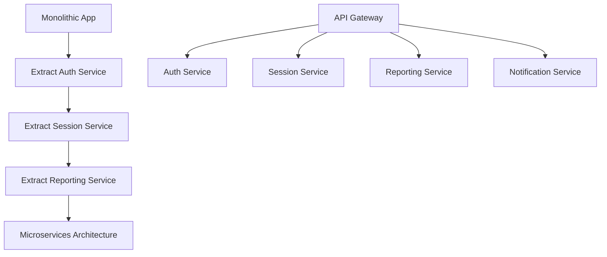

# 🏗️ Architecture Documentation

Comprehensive architecture guide for the SPA Operations Dashboard, covering system design, component relationships, data flow, and architectural decisions.

## 📋 Table of Contents

- [System Overview](#system-overview)
- [Architecture Patterns](#architecture-patterns)
- [Component Architecture](#component-architecture)
- [Data Flow](#data-flow)
- [State Management](#state-management)
- [Service Layer](#service-layer)
- [Security Architecture](#security-architecture)
- [Performance Considerations](#performance-considerations)
- [Scalability](#scalability)

## 🎯 System Overview

### High-Level Architecture



### Technology Stack

**Frontend**
- **React 19** - UI framework with modern hooks and concurrent features
- **TypeScript** - Type-safe development with strict configuration
- **Vite** - Fast build tool with HMR and optimized bundling
- **Tailwind CSS** - Utility-first CSS framework for responsive design

**Backend & Infrastructure**
- **Supabase** - Backend-as-a-Service with PostgreSQL, Auth, and Real-time
- **PostgreSQL** - Relational database with Row Level Security
- **Row Level Security (RLS)** - Database-level security policies

**Development & Testing**
- **Jest** - Unit testing framework
- **React Testing Library** - Component testing utilities
- **Playwright** - End-to-end testing framework
- **ESLint** - Code quality and consistency

## 🏛️ Architecture Patterns

### 1. Component-Based Architecture

The application follows a modular component-based architecture with clear separation of concerns:

```
src/components/
├── auth/                 # Authentication components
├── session/             # Session management components
├── roster/              # Roster management components
├── ui/                  # Reusable UI components
├── accessibility/       # Accessibility components
└── admin/               # Administrative components
```

### 2. Service Layer Pattern

Business logic is abstracted into service classes that handle data operations:

```typescript
// Service layer abstraction
class SessionService {
  async createSession(data: CreateSessionRequest): Promise<Session>
  async updateSession(session: Session): Promise<Session>
  async deleteSession(id: string): Promise<void>
}

// Usage in components
const sessionService = new SessionService()
const session = await sessionService.createSession(sessionData)
```

### 3. Custom Hooks Pattern

Reusable logic is encapsulated in custom hooks:

```typescript
// Custom hook for session management
const useSessionManagement = () => {
  const [sessions, setSessions] = useState<Session[]>([])
  const [loading, setLoading] = useState(false)
  
  const createSession = async (data: CreateSessionRequest) => {
    setLoading(true)
    try {
      const session = await sessionService.createSession(data)
      setSessions(prev => [...prev, session])
    } finally {
      setLoading(false)
    }
  }
  
  return { sessions, loading, createSession }
}
```

### 4. Context Provider Pattern

Global state is managed through React Context providers:

```typescript
// App-wide state management
const AppProvider = ({ children }) => {
  const [state, dispatch] = useReducer(appReducer, initialState)
  
  return (
    <AppContext.Provider value={{ state, dispatch }}>
      {children}
    </AppContext.Provider>
  )
}
```

## 🧩 Component Architecture

### Component Hierarchy

```
App
├── ErrorBoundary
├── CSRFProvider
├── AuthProvider
│   ├── SupabaseDataProvider
│   │   ├── AppProvider
│   │   │   ├── ToastProvider
│   │   │   │   ├── AppContent
│   │   │   │   │   ├── Header (UserMenu)
│   │   │   │   │   ├── ProtectedRoute
│   │   │   │   │   │   └── Route Components
│   │   │   │   │   │       ├── RosterSetup
│   │   │   │   │   │       ├── MainDashboard
│   │   │   │   │   │       │   ├── TherapistCard[]
│   │   │   │   │   │       │   └── SidePanel
│   │   │   │   │   │       ├── ClosingOut
│   │   │   │   │   │       └── AdminDashboard
│   │   │   │   │   └── AuthDebug
│   │   │   │   └── CSRFStatus
│   │   │   └── DebugButton
```

### Component Categories

#### 1. **Layout Components**
- **AppContent** - Main application wrapper
- **Header** - Navigation and user menu
- **ProtectedRoute** - Authentication guard

#### 2. **Feature Components**
- **RosterSetup** - Daily roster management
- **MainDashboard** - Real-time operations dashboard
- **ClosingOut** - Day-end summary and reporting
- **SessionModal** - Session creation and editing

#### 3. **UI Components**
- **TherapistCard** - Individual therapist display
- **SidePanel** - Secondary information panel
- **Button** - Reusable button component
- **Modal** - Modal dialog wrapper

#### 4. **Utility Components**
- **ErrorBoundary** - Error catching and display
- **LoadingScreen** - Loading state display
- **Toast** - Notification system

### Component Communication



## 🔄 Data Flow

### 1. **Unidirectional Data Flow**

Data flows in one direction through the application:

```
User Action → Event Handler → State Update → Component Re-render → UI Update
```

### 2. **Data Synchronization Flow**



### 3. **Real-time Updates**



### 4. **Error Handling Flow**



## 🗃️ State Management

### 1. **Application State Structure**

```typescript
interface AppState {
  // Application phase
  currentPhase: 'roster-setup' | 'daily-operations' | 'closing-out' | 'admin-dashboard' | 'todos'
  
  // Core data
  therapists: Therapist[]
  todayRoster: Therapist[]
  sessions: Session[]
  rooms: Room[]
  services: Service[]
  walkOuts: WalkOut[]
  
  // Calculated data
  dailyStats: DailyStats
  
  // UI state
  loading: boolean
  error: string | null
}
```

### 2. **State Management Patterns**

#### **Reducer Pattern**
```typescript
const appReducer = (state: AppState, action: AppAction): AppState => {
  switch (action.type) {
    case 'ADD_SESSION':
      return {
        ...state,
        sessions: [...state.sessions, action.payload]
      }
    case 'UPDATE_THERAPIST_STATUS':
      return {
        ...state,
        therapists: state.therapists.map(t => 
          t.id === action.payload.id 
            ? { ...t, status: action.payload.status }
            : t
        )
      }
    default:
      return state
  }
}
```

#### **Context Pattern**
```typescript
const AppContext = createContext<{
  state: AppState
  dispatch: React.Dispatch<AppAction>
} | null>(null)

const useApp = () => {
  const context = useContext(AppContext)
  if (!context) {
    throw new Error('useApp must be used within AppProvider')
  }
  return context
}
```

### 3. **State Persistence Strategy**

```typescript
// Hybrid persistence approach
const useDataPersistence = () => {
  // 1. Local storage for immediate availability
  const [localData, setLocalData] = useState(() => {
    return JSON.parse(localStorage.getItem('spa-data') || '{}')
  })
  
  // 2. Supabase for persistence and sync
  const [serverData, setServerData] = useState(null)
  
  // 3. Optimistic updates for better UX
  const updateData = async (newData) => {
    // Update local state immediately
    setLocalData(newData)
    
    // Sync with server in background
    try {
      await syncWithServer(newData)
    } catch (error) {
      // Rollback on failure
      setLocalData(previousData)
    }
  }
}
```

## 🔧 Service Layer

### 1. **Service Architecture**

```typescript
// Base service class
abstract class BaseService {
  protected supabase: SupabaseClient
  
  constructor() {
    this.supabase = createClient(
      import.meta.env.VITE_SUPABASE_URL,
      import.meta.env.VITE_SUPABASE_ANON_KEY
    )
  }
  
  protected async handleError(error: any): Promise<never> {
    console.error('Service error:', error)
    throw new Error(error.message || 'An error occurred')
  }
}

// Specific service implementation
class SessionService extends BaseService {
  async createSession(data: CreateSessionRequest): Promise<Session> {
    try {
      const { data: session, error } = await this.supabase
        .from('sessions')
        .insert(data)
        .select()
        .single()
      
      if (error) throw error
      return session
    } catch (error) {
      return this.handleError(error)
    }
  }
}
```

### 2. **Service Dependencies**



### 3. **Service Integration**

```typescript
// Service composition
class SpaOperationsService {
  private sessionService: SessionService
  private therapistService: TherapistService
  private walkoutService: WalkoutService
  
  constructor() {
    this.sessionService = new SessionService()
    this.therapistService = new TherapistService()
    this.walkoutService = new WalkoutService()
  }
  
  async startSession(sessionData: CreateSessionRequest): Promise<Session> {
    // 1. Create session
    const session = await this.sessionService.createSession(sessionData)
    
    // 2. Update therapist status
    await this.therapistService.updateStatus(
      sessionData.therapistIds[0], 
      'in-session'
    )
    
    // 3. Update room status
    await this.roomService.updateStatus(sessionData.roomId, 'occupied')
    
    return session
  }
}
```

## 🔒 Security Architecture

### 1. **Authentication Flow**



### 2. **Authorization Layers**

#### **Client-Side Authorization**
```typescript
// Route protection
const ProtectedRoute = ({ children }: { children: React.ReactNode }) => {
  const { isAuthenticated, loading } = useAuth()
  
  if (loading) return <LoadingScreen />
  if (!isAuthenticated) return <AuthModal />
  
  return <>{children}</>
}
```

#### **Database-Level Authorization**
```sql
-- Row Level Security policies
CREATE POLICY "Users can only see their own data" ON sessions
  FOR ALL USING (auth.uid() = user_id);

CREATE POLICY "Admins can see all data" ON sessions
  FOR ALL USING (
    EXISTS (
      SELECT 1 FROM user_profiles 
      WHERE user_id = auth.uid() 
      AND role = 'admin'
    )
  );
```

### 3. **CSRF Protection**

```typescript
// CSRF token management
const CSRFProvider = ({ children }: { children: React.ReactNode }) => {
  const [csrfToken, setCsrfToken] = useState<string | null>(null)
  
  useEffect(() => {
    // Generate and store CSRF token
    const token = generateCSRFToken()
    setCsrfToken(token)
    localStorage.setItem('csrf-token', token)
  }, [])
  
  return (
    <CSRFContext.Provider value={{ csrfToken }}>
      {children}
    </CSRFContext.Provider>
  )
}
```

## ⚡ Performance Considerations

### 1. **Code Splitting Strategy**

```typescript
// Route-based code splitting
const RosterSetup = lazy(() => import('../components/RosterSetup'))
const MainDashboard = lazy(() => import('../components/MainDashboard'))
const ClosingOut = lazy(() => import('../components/ClosingOut'))

// Component-based code splitting
const SessionModal = lazy(() => import('../components/SessionModal'))
const WalkOutTable = lazy(() => import('../components/WalkOutTable'))
```

### 2. **Data Loading Optimization**

```typescript
// Parallel data loading
const useInitialData = () => {
  const [loading, setLoading] = useState(true)
  
  useEffect(() => {
    const loadData = async () => {
      // Load all initial data in parallel
      const [therapists, rooms, services] = await Promise.all([
        therapistService.getTherapists(),
        roomService.getRooms(),
        serviceService.getServices()
      ])
      
      // Update state
      dispatch({ type: 'SET_INITIAL_DATA', payload: { therapists, rooms, services } })
      setLoading(false)
    }
    
    loadData()
  }, [])
  
  return { loading }
}
```

### 3. **Caching Strategy**

```typescript
// Multi-level caching
const useCachedData = <T>(key: string, fetcher: () => Promise<T>) => {
  // 1. Memory cache
  const memoryCache = useRef<Map<string, T>>(new Map())
  
  // 2. Local storage cache
  const localStorageCache = localStorage.getItem(key)
  
  // 3. Network request
  const fetchData = async () => {
    if (memoryCache.current.has(key)) {
      return memoryCache.current.get(key)!
    }
    
    const data = await fetcher()
    memoryCache.current.set(key, data)
    localStorage.setItem(key, JSON.stringify(data))
    
    return data
  }
}
```

### 4. **Performance Monitoring**

```typescript
// Web Vitals tracking
const useWebVitals = () => {
  useEffect(() => {
    import('web-vitals').then(({ getCLS, getFID, getFCP, getLCP, getTTFB }) => {
      getCLS(console.log)
      getFID(console.log)
      getFCP(console.log)
      getLCP(console.log)
      getTTFB(console.log)
    })
  }, [])
}
```

## 📈 Scalability

### 1. **Horizontal Scaling Considerations**

#### **Database Scaling**
- **Read Replicas** - For read-heavy operations
- **Connection Pooling** - Efficient database connections
- **Query Optimization** - Indexed queries and efficient joins

#### **Application Scaling**
- **Stateless Design** - No server-side session storage
- **CDN Integration** - Static asset delivery
- **Caching Layers** - Redis for session data

### 2. **Microservices Migration Path**



### 3. **Performance Optimization Strategies**

#### **Frontend Optimization**
- **Bundle Splitting** - Route and component-based splitting
- **Tree Shaking** - Remove unused code
- **Image Optimization** - WebP format with fallbacks
- **Service Workers** - Offline functionality and caching

#### **Backend Optimization**
- **Database Indexing** - Optimized query performance
- **Connection Pooling** - Efficient resource usage
- **Caching** - Redis for frequently accessed data
- **CDN** - Global content delivery

## 🔮 Future Architecture Considerations

### 1. **Progressive Web App (PWA)**
- **Service Workers** - Offline functionality
- **App Shell** - Fast loading experience
- **Push Notifications** - Real-time updates
- **Background Sync** - Data synchronization

### 2. **Real-time Enhancements**
- **WebSocket Connections** - Direct real-time communication
- **Event Sourcing** - Audit trail and state reconstruction
- **CQRS** - Command Query Responsibility Segregation

### 3. **Advanced Features**
- **Multi-tenant Architecture** - Support for multiple spas
- **Advanced Analytics** - Machine learning insights
- **Mobile Applications** - React Native implementation
- **API Versioning** - Backward compatibility

---

*This architecture documentation is maintained alongside the codebase. For the latest updates, refer to the source code and design decisions in the project repository.*
