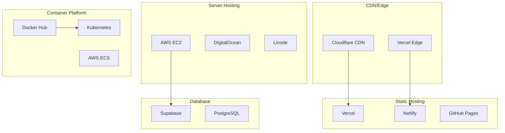

# 🚀 Deployment Guide

Comprehensive deployment and infrastructure guide for the SPA Operations Dashboard, covering various deployment options, CI/CD pipelines, monitoring, and maintenance.

## 📋 Table of Contents

- [Deployment Overview](#deployment-overview)
- [Environment Setup](#environment-setup)
- [Static Hosting Deployment](#static-hosting-deployment)
- [Server Deployment](#server-deployment)
- [Container Deployment](#container-deployment)
- [CI/CD Pipeline](#cicd-pipeline)
- [Monitoring & Logging](#monitoring--logging)
- [Security Configuration](#security-configuration)
- [Maintenance & Updates](#maintenance--updates)
- [Troubleshooting](#troubleshooting)

## 🌐 Deployment Overview

### Deployment Architecture



### Deployment Options Comparison

| Option | Pros | Cons | Best For |
|--------|------|------|----------|
| **Static Hosting** | Fast, simple, cost-effective | Limited server features | Small to medium spas |
| **Server Deployment** | Full control, custom features | More complex setup | Large spas, custom needs |
| **Container Platform** | Scalable, portable | Complex orchestration | Enterprise deployments |

## ⚙️ Environment Setup

### Production Environment Variables

```bash
# Required - Supabase Configuration
VITE_SUPABASE_URL=https://your-project.supabase.co
VITE_SUPABASE_ANON_KEY=your_production_anon_key

# Application Configuration
VITE_APP_ENV=production
VITE_APP_NAME="SPA Operations Dashboard"
VITE_APP_VERSION=1.0.0

# Optional - Monitoring
VITE_SENTRY_DSN=your_production_sentry_dsn
VITE_GOOGLE_ANALYTICS_ID=your_ga_id

# Optional - Feature Flags
VITE_ENABLE_DEBUG=false
VITE_ENABLE_ANALYTICS=true
VITE_ENABLE_ERROR_REPORTING=true

# Optional - Performance
VITE_ENABLE_PWA=true
VITE_CACHE_VERSION=1.0.0
```

### Environment Validation

```typescript
// Environment validation script
const validateEnvironment = () => {
  const required = [
    'VITE_SUPABASE_URL',
    'VITE_SUPABASE_ANON_KEY',
    'VITE_APP_ENV'
  ]
  
  const missing = required.filter(key => !import.meta.env[key])
  
  if (missing.length > 0) {
    throw new Error(`Missing required environment variables: ${missing.join(', ')}`)
  }
  
  console.log('✅ Environment validation passed')
}

validateEnvironment()
```

## 📦 Static Hosting Deployment

### Option 1: Vercel (Recommended)

#### Automatic Deployment
```bash
# 1. Connect GitHub repository to Vercel
# 2. Configure environment variables in Vercel dashboard
# 3. Deploy automatically on push to main branch
```

#### Manual Deployment
```bash
# Install Vercel CLI
npm install -g vercel

# Login to Vercel
vercel login

# Deploy
vercel --prod

# Set environment variables
vercel env add VITE_SUPABASE_URL
vercel env add VITE_SUPABASE_ANON_KEY
```

#### Vercel Configuration
```json
// vercel.json
{
  "builds": [
    {
      "src": "package.json",
      "use": "@vercel/static-build",
      "config": {
        "distDir": "dist"
      }
    }
  ],
  "routes": [
    {
      "src": "/(.*)",
      "dest": "/index.html"
    }
  ],
  "headers": [
    {
      "source": "/(.*)",
      "headers": [
        {
          "key": "X-Content-Type-Options",
          "value": "nosniff"
        },
        {
          "key": "X-Frame-Options",
          "value": "DENY"
        },
        {
          "key": "X-XSS-Protection",
          "value": "1; mode=block"
        }
      ]
    }
  ]
}
```

### Option 2: Netlify

#### Netlify Configuration
```toml
# netlify.toml
[build]
  command = "npm run build"
  publish = "dist"

[build.environment]
  NODE_VERSION = "18"

[[redirects]]
  from = "/*"
  to = "/index.html"
  status = 200

[[headers]]
  for = "/*"
  [headers.values]
    X-Frame-Options = "DENY"
    X-XSS-Protection = "1; mode=block"
    X-Content-Type-Options = "nosniff"

[[headers]]
  for = "/static/*"
  [headers.values]
    Cache-Control = "public, max-age=31536000, immutable"
```

#### Deployment Commands
```bash
# Install Netlify CLI
npm install -g netlify-cli

# Deploy to Netlify
netlify deploy --prod --dir=dist

# Set environment variables
netlify env:set VITE_SUPABASE_URL "your_url"
netlify env:set VITE_SUPABASE_ANON_KEY "your_key"
```

### Option 3: GitHub Pages

#### GitHub Actions Workflow
```yaml
# .github/workflows/deploy.yml
name: Deploy to GitHub Pages

on:
  push:
    branches: [ main ]

jobs:
  deploy:
    runs-on: ubuntu-latest
    
    steps:
    - uses: actions/checkout@v3
    
    - name: Setup Node.js
      uses: actions/setup-node@v3
      with:
        node-version: '18'
        cache: 'npm'
    
    - name: Install dependencies
      run: npm ci
    
    - name: Build
      run: npm run build
      env:
        VITE_SUPABASE_URL: ${{ secrets.VITE_SUPABASE_URL }}
        VITE_SUPABASE_ANON_KEY: ${{ secrets.VITE_SUPABASE_ANON_KEY }}
    
    - name: Deploy to GitHub Pages
      uses: peaceiris/actions-gh-pages@v3
      with:
        github_token: ${{ secrets.GITHUB_TOKEN }}
        publish_dir: ./dist
```

## 🖥️ Server Deployment

### Option 1: Nginx + Node.js

#### Server Setup
```bash
# Update system
sudo apt update && sudo apt upgrade -y

# Install Node.js 18
curl -fsSL https://deb.nodesource.com/setup_18.x | sudo -E bash -
sudo apt-get install -y nodejs

# Install Nginx
sudo apt install nginx -y

# Install PM2 for process management
sudo npm install -g pm2
```

#### Nginx Configuration
```nginx
# /etc/nginx/sites-available/spa-dashboard
server {
    listen 80;
    server_name your-domain.com;
    
    # Security headers
    add_header X-Frame-Options "SAMEORIGIN" always;
    add_header X-XSS-Protection "1; mode=block" always;
    add_header X-Content-Type-Options "nosniff" always;
    add_header Referrer-Policy "no-referrer-when-downgrade" always;
    add_header Content-Security-Policy "default-src 'self' http: https: data: blob: 'unsafe-inline'" always;
    
    # Gzip compression
    gzip on;
    gzip_vary on;
    gzip_min_length 1024;
    gzip_proxied expired no-cache no-store private must-revalidate auth;
    gzip_types text/plain text/css text/xml text/javascript application/x-javascript application/xml+rss;
    
    # Static files
    location / {
        root /var/www/spa-dashboard/dist;
        try_files $uri $uri/ /index.html;
        
        # Cache static assets
        location ~* \.(js|css|png|jpg|jpeg|gif|ico|svg)$ {
            expires 1y;
            add_header Cache-Control "public, immutable";
        }
    }
    
    # API proxy (if needed)
    location /api/ {
        proxy_pass https://your-supabase-url.supabase.co;
        proxy_set_header Host $host;
        proxy_set_header X-Real-IP $remote_addr;
        proxy_set_header X-Forwarded-For $proxy_add_x_forwarded_for;
        proxy_set_header X-Forwarded-Proto $scheme;
    }
}
```

#### PM2 Configuration
```json
// ecosystem.config.js
module.exports = {
  apps: [{
    name: 'spa-dashboard',
    script: 'npm',
    args: 'run preview',
    cwd: '/var/www/spa-dashboard',
    env: {
      NODE_ENV: 'production',
      PORT: 4173
    },
    instances: 1,
    exec_mode: 'fork',
    watch: false,
    max_memory_restart: '1G',
    error_file: '/var/log/pm2/spa-dashboard-error.log',
    out_file: '/var/log/pm2/spa-dashboard-out.log',
    log_file: '/var/log/pm2/spa-dashboard.log'
  }]
}
```

#### Deployment Script
```bash
#!/bin/bash
# deploy.sh

# Build the application
npm run build

# Copy files to server
rsync -avz --delete dist/ user@server:/var/www/spa-dashboard/dist/

# Restart services
ssh user@server 'cd /var/www/spa-dashboard && pm2 restart spa-dashboard'
ssh user@server 'sudo systemctl reload nginx'
```

### Option 2: Apache + PHP

#### Apache Configuration
```apache
# /etc/apache2/sites-available/spa-dashboard.conf
<VirtualHost *:80>
    ServerName your-domain.com
    DocumentRoot /var/www/spa-dashboard/dist
    
    # Security headers
    Header always set X-Frame-Options "SAMEORIGIN"
    Header always set X-XSS-Protection "1; mode=block"
    Header always set X-Content-Type-Options "nosniff"
    
    # Rewrite rules for SPA
    RewriteEngine On
    RewriteCond %{REQUEST_FILENAME} !-f
    RewriteCond %{REQUEST_FILENAME} !-d
    RewriteRule . /index.html [L]
    
    # Cache static assets
    <LocationMatch "\.(js|css|png|jpg|jpeg|gif|ico|svg)$">
        ExpiresActive On
        ExpiresDefault "access plus 1 year"
        Header set Cache-Control "public, immutable"
    </LocationMatch>
</VirtualHost>
```

## 🐳 Container Deployment

### Docker Configuration

#### Dockerfile
```dockerfile
# Multi-stage build
FROM node:18-alpine AS builder

# Set working directory
WORKDIR /app

# Copy package files
COPY package*.json ./

# Install dependencies
RUN npm ci --only=production

# Copy source code
COPY . .

# Build application
RUN npm run build

# Production stage
FROM nginx:alpine

# Copy built application
COPY --from=builder /app/dist /usr/share/nginx/html

# Copy nginx configuration
COPY nginx.conf /etc/nginx/nginx.conf

# Expose port
EXPOSE 80

# Start nginx
CMD ["nginx", "-g", "daemon off;"]
```

#### Nginx Configuration for Docker
```nginx
# nginx.conf
events {
    worker_connections 1024;
}

http {
    include /etc/nginx/mime.types;
    default_type application/octet-stream;
    
    # Gzip compression
    gzip on;
    gzip_types text/plain text/css application/json application/javascript text/xml application/xml application/xml+rss text/javascript;
    
    server {
        listen 80;
        server_name localhost;
        root /usr/share/nginx/html;
        index index.html;
        
        # Security headers
        add_header X-Frame-Options "SAMEORIGIN" always;
        add_header X-XSS-Protection "1; mode=block" always;
        add_header X-Content-Type-Options "nosniff" always;
        
        # Handle SPA routing
        location / {
            try_files $uri $uri/ /index.html;
        }
        
        # Cache static assets
        location ~* \.(js|css|png|jpg|jpeg|gif|ico|svg)$ {
            expires 1y;
            add_header Cache-Control "public, immutable";
        }
    }
}
```

#### Docker Compose
```yaml
# docker-compose.yml
version: '3.8'

services:
  spa-dashboard:
    build: .
    ports:
      - "80:80"
    environment:
      - VITE_SUPABASE_URL=${VITE_SUPABASE_URL}
      - VITE_SUPABASE_ANON_KEY=${VITE_SUPABASE_ANON_KEY}
    restart: unless-stopped
    healthcheck:
      test: ["CMD", "curl", "-f", "http://localhost:80"]
      interval: 30s
      timeout: 10s
      retries: 3

  # Optional: Add reverse proxy
  nginx-proxy:
    image: nginx:alpine
    ports:
      - "443:443"
    volumes:
      - ./nginx-proxy.conf:/etc/nginx/nginx.conf
      - ./ssl:/etc/nginx/ssl
    depends_on:
      - spa-dashboard
```

#### Build and Deploy
```bash
# Build Docker image
docker build -t spa-dashboard .

# Run container
docker run -d \
  --name spa-dashboard \
  -p 80:80 \
  -e VITE_SUPABASE_URL="your_url" \
  -e VITE_SUPABASE_ANON_KEY="your_key" \
  spa-dashboard

# Using Docker Compose
docker-compose up -d
```

### Kubernetes Deployment

#### Kubernetes Manifests
```yaml
# k8s/deployment.yaml
apiVersion: apps/v1
kind: Deployment
metadata:
  name: spa-dashboard
spec:
  replicas: 3
  selector:
    matchLabels:
      app: spa-dashboard
  template:
    metadata:
      labels:
        app: spa-dashboard
    spec:
      containers:
      - name: spa-dashboard
        image: your-registry/spa-dashboard:latest
        ports:
        - containerPort: 80
        env:
        - name: VITE_SUPABASE_URL
          valueFrom:
            secretKeyRef:
              name: spa-secrets
              key: supabase-url
        - name: VITE_SUPABASE_ANON_KEY
          valueFrom:
            secretKeyRef:
              name: spa-secrets
              key: supabase-anon-key
        resources:
          requests:
            memory: "64Mi"
            cpu: "50m"
          limits:
            memory: "128Mi"
            cpu: "100m"
        livenessProbe:
          httpGet:
            path: /
            port: 80
          initialDelaySeconds: 30
          periodSeconds: 10
        readinessProbe:
          httpGet:
            path: /
            port: 80
          initialDelaySeconds: 5
          periodSeconds: 5
---
apiVersion: v1
kind: Service
metadata:
  name: spa-dashboard-service
spec:
  selector:
    app: spa-dashboard
  ports:
  - port: 80
    targetPort: 80
  type: ClusterIP
---
apiVersion: networking.k8s.io/v1
kind: Ingress
metadata:
  name: spa-dashboard-ingress
  annotations:
    nginx.ingress.kubernetes.io/rewrite-target: /
spec:
  rules:
  - host: your-domain.com
    http:
      paths:
      - path: /
        pathType: Prefix
        backend:
          service:
            name: spa-dashboard-service
            port:
              number: 80
```

#### Deploy to Kubernetes
```bash
# Create secrets
kubectl create secret generic spa-secrets \
  --from-literal=supabase-url="your_url" \
  --from-literal=supabase-anon-key="your_key"

# Deploy application
kubectl apply -f k8s/

# Check deployment status
kubectl get pods
kubectl get services
kubectl get ingress
```

## 🔄 CI/CD Pipeline

### GitHub Actions Workflow

#### Complete CI/CD Pipeline
```yaml
# .github/workflows/ci-cd.yml
name: CI/CD Pipeline

on:
  push:
    branches: [ main, develop ]
  pull_request:
    branches: [ main ]

env:
  NODE_VERSION: '18'

jobs:
  test:
    runs-on: ubuntu-latest
    
    steps:
    - name: Checkout code
      uses: actions/checkout@v3
    
    - name: Setup Node.js
      uses: actions/setup-node@v3
      with:
        node-version: ${{ env.NODE_VERSION }}
        cache: 'npm'
    
    - name: Install dependencies
      run: npm ci
    
    - name: Run linter
      run: npm run lint
    
    - name: Run unit tests
      run: npm run test:coverage
    
    - name: Upload coverage to Codecov
      uses: codecov/codecov-action@v3
      with:
        file: ./coverage/lcov.info
    
    - name: Install Playwright
      run: npx playwright install --with-deps
    
    - name: Run E2E tests
      run: npm run test:e2e
      env:
        VITE_SUPABASE_URL: ${{ secrets.VITE_SUPABASE_URL }}
        VITE_SUPABASE_ANON_KEY: ${{ secrets.VITE_SUPABASE_ANON_KEY }}

  build:
    needs: test
    runs-on: ubuntu-latest
    if: github.ref == 'refs/heads/main'
    
    steps:
    - name: Checkout code
      uses: actions/checkout@v3
    
    - name: Setup Node.js
      uses: actions/setup-node@v3
      with:
        node-version: ${{ env.NODE_VERSION }}
        cache: 'npm'
    
    - name: Install dependencies
      run: npm ci
    
    - name: Build application
      run: npm run build
      env:
        VITE_SUPABASE_URL: ${{ secrets.VITE_SUPABASE_URL }}
        VITE_SUPABASE_ANON_KEY: ${{ secrets.VITE_SUPABASE_ANON_KEY }}
        VITE_APP_ENV: production
    
    - name: Upload build artifacts
      uses: actions/upload-artifact@v3
      with:
        name: build-files
        path: dist/

  deploy:
    needs: build
    runs-on: ubuntu-latest
    if: github.ref == 'refs/heads/main'
    
    steps:
    - name: Download build artifacts
      uses: actions/download-artifact@v3
      with:
        name: build-files
        path: dist/
    
    - name: Deploy to Vercel
      uses: amondnet/vercel-action@v25
      with:
        vercel-token: ${{ secrets.VERCEL_TOKEN }}
        vercel-org-id: ${{ secrets.VERCEL_ORG_ID }}
        vercel-project-id: ${{ secrets.VERCEL_PROJECT_ID }}
        working-directory: ./
        vercel-args: '--prod'
    
    - name: Deploy to staging
      if: github.ref == 'refs/heads/develop'
      run: |
        echo "Deploying to staging environment"
        # Add staging deployment steps
```

### GitLab CI/CD

#### GitLab Pipeline
```yaml
# .gitlab-ci.yml
stages:
  - test
  - build
  - deploy

variables:
  NODE_VERSION: "18"

test:
  stage: test
  image: node:18-alpine
  script:
    - npm ci
    - npm run lint
    - npm run test:coverage
    - npx playwright install --with-deps
    - npm run test:e2e
  artifacts:
    reports:
      coverage_report:
        coverage_format: cobertura
        path: coverage/cobertura-coverage.xml
    paths:
      - coverage/
    expire_in: 1 week

build:
  stage: build
  image: node:18-alpine
  script:
    - npm ci
    - npm run build
  artifacts:
    paths:
      - dist/
    expire_in: 1 hour
  only:
    - main

deploy_production:
  stage: deploy
  image: alpine:latest
  script:
    - apk add --no-cache curl
    - curl -X POST -H "Authorization: Bearer $VERCEL_TOKEN" https://api.vercel.com/v1/integrations/deploy/$VERCEL_PROJECT_ID
  only:
    - main
  dependencies:
    - build
```

## 📊 Monitoring & Logging

### Application Monitoring

#### Sentry Integration
```typescript
// src/config/monitoring.ts
import * as Sentry from '@sentry/react'

export const initializeMonitoring = () => {
  if (import.meta.env.VITE_SENTRY_DSN) {
    Sentry.init({
      dsn: import.meta.env.VITE_SENTRY_DSN,
      environment: import.meta.env.VITE_APP_ENV,
      tracesSampleRate: 1.0,
      beforeSend(event) {
        // Filter out development errors
        if (import.meta.env.VITE_APP_ENV === 'development') {
          return null
        }
        return event
      }
    })
  }
}
```

#### Performance Monitoring
```typescript
// src/hooks/usePerformanceMonitoring.ts
import { useEffect } from 'react'

export const useWebVitals = () => {
  useEffect(() => {
    import('web-vitals').then(({ getCLS, getFID, getFCP, getLCP, getTTFB }) => {
      getCLS(sendToAnalytics)
      getFID(sendToAnalytics)
      getFCP(sendToAnalytics)
      getLCP(sendToAnalytics)
      getTTFB(sendToAnalytics)
    })
  }, [])
}

const sendToAnalytics = (metric: any) => {
  // Send to your analytics service
  console.log('Web Vital:', metric)
}
```

### Server Monitoring

#### Health Checks
```bash
#!/bin/bash
# health-check.sh

# Check application health
curl -f http://localhost:80/health || exit 1

# Check database connectivity
curl -f "$VITE_SUPABASE_URL/rest/v1/" \
  -H "apikey: $VITE_SUPABASE_ANON_KEY" || exit 1

# Check disk space
df -h / | awk 'NR==2 {if ($5+0 > 90) exit 1}'

echo "Health check passed"
```

#### Log Management
```bash
# Log rotation configuration
# /etc/logrotate.d/spa-dashboard
/var/log/spa-dashboard/*.log {
    daily
    missingok
    rotate 30
    compress
    delaycompress
    notifempty
    create 644 www-data www-data
    postrotate
        systemctl reload nginx
    endscript
}
```

### Uptime Monitoring

#### Uptime Robot Configuration
```json
{
  "friendly_name": "SPA Dashboard",
  "url": "https://your-domain.com",
  "type": "http",
  "sub_type": "http80",
  "port": 80,
  "keyword_type": "http",
  "keyword_value": "SPA Operations Dashboard",
  "interval": 300,
  "timeout": 30,
  "alert_contacts": ["your-contact-id"]
}
```

## 🔒 Security Configuration

### SSL/TLS Setup

#### Let's Encrypt with Certbot
```bash
# Install Certbot
sudo apt install certbot python3-certbot-nginx -y

# Obtain SSL certificate
sudo certbot --nginx -d your-domain.com

# Auto-renewal
sudo crontab -e
# Add: 0 12 * * * /usr/bin/certbot renew --quiet
```

#### Nginx SSL Configuration
```nginx
server {
    listen 443 ssl http2;
    server_name your-domain.com;
    
    ssl_certificate /etc/letsencrypt/live/your-domain.com/fullchain.pem;
    ssl_certificate_key /etc/letsencrypt/live/your-domain.com/privkey.pem;
    
    # SSL configuration
    ssl_protocols TLSv1.2 TLSv1.3;
    ssl_ciphers ECDHE-RSA-AES256-GCM-SHA512:DHE-RSA-AES256-GCM-SHA512:ECDHE-RSA-AES256-GCM-SHA384:DHE-RSA-AES256-GCM-SHA384;
    ssl_prefer_server_ciphers off;
    ssl_session_cache shared:SSL:10m;
    ssl_session_timeout 10m;
    
    # Security headers
    add_header Strict-Transport-Security "max-age=31536000; includeSubDomains" always;
    add_header X-Frame-Options "SAMEORIGIN" always;
    add_header X-Content-Type-Options "nosniff" always;
    add_header X-XSS-Protection "1; mode=block" always;
    add_header Referrer-Policy "no-referrer-when-downgrade" always;
    
    # Application files
    root /var/www/spa-dashboard/dist;
    index index.html;
    
    location / {
        try_files $uri $uri/ /index.html;
    }
}

# Redirect HTTP to HTTPS
server {
    listen 80;
    server_name your-domain.com;
    return 301 https://$server_name$request_uri;
}
```

### Security Headers

#### Content Security Policy
```typescript
// CSP configuration
const cspDirectives = {
  'default-src': ["'self'"],
  'script-src': ["'self'", "'unsafe-inline'", "https://your-supabase-url.supabase.co"],
  'style-src': ["'self'", "'unsafe-inline'"],
  'img-src': ["'self'", "data:", "https:"],
  'connect-src': ["'self'", "https://your-supabase-url.supabase.co"],
  'font-src': ["'self'"],
  'object-src': ["'none'"],
  'base-uri': ["'self'"],
  'form-action': ["'self'"],
  'frame-ancestors': ["'none'"]
}
```

### Access Control

#### Firewall Configuration
```bash
# UFW firewall setup
sudo ufw enable
sudo ufw default deny incoming
sudo ufw default allow outgoing
sudo ufw allow ssh
sudo ufw allow 80/tcp
sudo ufw allow 443/tcp

# Check status
sudo ufw status verbose
```

## 🔧 Maintenance & Updates

### Automated Updates

#### Update Script
```bash
#!/bin/bash
# update.sh

set -e

echo "Starting application update..."

# Backup current version
cp -r /var/www/spa-dashboard /var/www/spa-dashboard.backup.$(date +%Y%m%d_%H%M%S)

# Pull latest code
cd /var/www/spa-dashboard
git pull origin main

# Install dependencies
npm ci

# Build application
npm run build

# Run tests
npm test

# Restart services
pm2 restart spa-dashboard
sudo systemctl reload nginx

echo "Update completed successfully!"
```

#### Scheduled Updates
```bash
# Add to crontab for weekly updates
0 2 * * 0 /var/www/spa-dashboard/scripts/update.sh >> /var/log/spa-dashboard-update.log 2>&1
```

### Database Maintenance

#### Backup Script
```bash
#!/bin/bash
# backup.sh

# Create backup directory
mkdir -p /var/backups/spa-dashboard/$(date +%Y%m%d)

# Export Supabase data (if using Supabase CLI)
supabase db dump --local > /var/backups/spa-dashboard/$(date +%Y%m%d)/backup.sql

# Compress backup
gzip /var/backups/spa-dashboard/$(date +%Y%m%d)/backup.sql

# Clean old backups (keep 30 days)
find /var/backups/spa-dashboard -type d -mtime +30 -exec rm -rf {} \;

echo "Backup completed: /var/backups/spa-dashboard/$(date +%Y%m%d)/"
```

### Performance Monitoring

#### Performance Dashboard
```bash
#!/bin/bash
# performance-monitor.sh

# Check system resources
echo "=== System Resources ==="
free -h
df -h
top -bn1 | head -20

# Check application performance
echo "=== Application Performance ==="
curl -w "@curl-format.txt" -o /dev/null -s "http://localhost:80"

# Check database performance
echo "=== Database Performance ==="
curl -s "$VITE_SUPABASE_URL/rest/v1/" \
  -H "apikey: $VITE_SUPABASE_ANON_KEY" \
  -w "Response time: %{time_total}s\n"
```

## 🐛 Troubleshooting

### Common Issues

#### Application Won't Start
```bash
# Check logs
pm2 logs spa-dashboard
journalctl -u nginx

# Check configuration
nginx -t
pm2 status

# Restart services
pm2 restart spa-dashboard
sudo systemctl restart nginx
```

#### Build Failures
```bash
# Clear cache and rebuild
rm -rf node_modules package-lock.json
npm cache clean --force
npm install
npm run build
```

#### Database Connection Issues
```bash
# Test Supabase connection
curl -I "$VITE_SUPABASE_URL/rest/v1/"

# Check environment variables
env | grep VITE_SUPABASE

# Verify API key permissions
curl -H "apikey: $VITE_SUPABASE_ANON_KEY" \
     "$VITE_SUPABASE_URL/rest/v1/therapists"
```

### Debugging Tools

#### Development Debug Mode
```bash
# Enable debug logging
export VITE_DEBUG=true
export VITE_LOG_LEVEL=debug

# Run with debug information
npm run dev
```

#### Production Debug
```bash
# Check application status
pm2 status
pm2 logs spa-dashboard --lines 100

# Monitor system resources
htop
iotop
netstat -tulpn
```

### Recovery Procedures

#### Application Recovery
```bash
# Restore from backup
sudo systemctl stop nginx
sudo systemctl stop pm2
cp -r /var/www/spa-dashboard.backup.YYYYMMDD_HHMMSS/* /var/www/spa-dashboard/
sudo systemctl start nginx
pm2 start ecosystem.config.js
```

#### Database Recovery
```bash
# Restore database from backup
gunzip /var/backups/spa-dashboard/YYYYMMDD/backup.sql.gz
supabase db reset --local
supabase db restore /var/backups/spa-dashboard/YYYYMMDD/backup.sql
```

---

**Deployment Complete!** 🎉

Your SPA Operations Dashboard is now deployed and ready for production use. Monitor the application closely during the first few days and adjust configurations as needed.

For additional support, check the [Troubleshooting Guide](TROUBLESHOOTING.md) or contact your system administrator.
