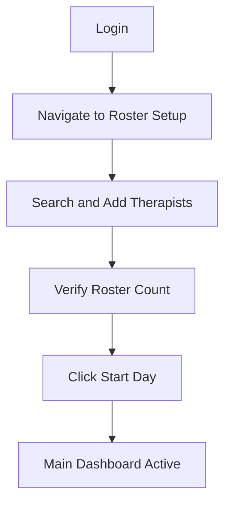

# ❓ Frequently Asked Questions (FAQ)

Common questions and answers about the SPA Operations Dashboard.

## 📋 Table of Contents

- [General Questions](#general-questions)
- [Setup & Installation](#setup--installation)
- [Authentication](#authentication)
- [Daily Operations](#daily-operations)
- [Troubleshooting](#troubleshooting)
- [Technical Questions](#technical-questions)

## 🤔 General Questions

### What is the SPA Operations Dashboard?

The SPA Operations Dashboard is a comprehensive web application designed to manage day-to-day operations at spa facilities. It handles therapist scheduling, session management, financial tracking, and provides real-time operational visibility.

### Who can use this application?

The dashboard is designed for:
- **Spa Managers** - Daily operations oversight
- **Front Desk Staff** - Session management and customer service
- **Administrators** - System configuration and user management
- **Owners** - Financial reporting and business insights

### What features does it include?

**Core Features:**
- Daily roster management
- Session creation and tracking
- Real-time dashboard with live updates
- Financial reporting and expense tracking
- Walk-out and no-show management
- Receipt generation and printing
- Data export capabilities

**Advanced Features:**
- Multi-therapist session support
- Dynamic pricing and discount management
- Room availability tracking
- Performance monitoring
- Offline functionality
- Mobile-responsive design

### Is this application secure?

Yes, the application implements multiple security layers:
- **Authentication** - Secure login with Supabase Auth
- **Authorization** - Role-based access control
- **Data Protection** - Row Level Security (RLS) policies
- **CSRF Protection** - Built-in CSRF token validation
- **HTTPS** - Encrypted data transmission
- **Input Validation** - Client and server-side validation

## 🛠️ Setup & Installation

### What are the system requirements?

**Minimum Requirements:**
- Node.js 18.0.0+
- Modern web browser (Chrome 90+, Firefox 88+, Safari 14+, Edge 90+)
- Internet connection for Supabase integration
- 2GB RAM, 1GB storage

**Recommended:**
- Node.js 18.0.0+ (latest LTS)
- 4GB+ RAM
- SSD storage
- High-speed internet connection

### How do I install the application?

1. **Clone the repository**
   ```bash
   git clone <repository-url>
   cd spa-ops-dashboard-dev
   ```

2. **Install dependencies**
   ```bash
   npm install
   ```

3. **Set up environment variables**
   ```bash
   cp .env.example .env.local
   # Edit .env.local with your Supabase credentials
   ```

4. **Set up the database**
   - Follow the [Database Setup Guide](../database/README.md)
   - Run SQL scripts in the correct order

5. **Start the application**
   ```bash
   npm run dev
   ```

### Do I need a Supabase account?

Yes, Supabase is required for:
- User authentication
- Data storage and persistence
- Real-time updates
- Row Level Security

**Getting Started with Supabase:**
1. Create a free account at [supabase.com](https://supabase.com)
2. Create a new project
3. Get your project URL and anon key
4. Follow the database setup guide

### Can I run this locally without internet?

**Partially** - The application requires internet for:
- Initial data loading from Supabase
- Real-time updates
- User authentication

**Offline Capabilities:**
- Local storage caching
- Session data persistence
- Basic operations (with sync when online)

## 🔐 Authentication

### What are the default login credentials?

**Test Credentials:**
- **Email:** `admin@spa.com`
- **Password:** `test123`

⚠️ **Important:** Change these credentials in production!

### How do I create new users?

**Admin User Creation:**
1. Run the admin user creation script in Supabase
2. Use the SQL script: `database/admin/create-admin-user-safe.sql`

**Regular User Creation:**
1. Use Supabase Auth dashboard
2. Create user accounts through the authentication system
3. Assign appropriate roles and permissions

### I can't log in. What should I do?

**Troubleshooting Steps:**
1. **Check credentials** - Verify email and password
2. **Check internet connection** - Ensure Supabase is accessible
3. **Clear browser cache** - Remove old authentication tokens
4. **Check Supabase status** - Verify your project is active
5. **Run diagnostics** - Use troubleshooting SQL scripts

**Common Issues:**
- **"Invalid credentials"** - Check username/password
- **"Network error"** - Check internet connection
- **"Session expired"** - Clear cache and log in again

### How do I reset my password?

**Password Reset Options:**
1. **Supabase Dashboard** - Reset through Supabase Auth
2. **Admin Script** - Recreate admin user with new password
3. **Database Direct** - Update password hash in database

## 📅 Daily Operations

### How do I start my day?

**Daily Startup Process:**
1. **Login** - Access the dashboard
2. **Setup Roster** - Add therapists for the day
3. **Start Day** - Begin daily operations
4. **Monitor Dashboard** - Watch for session updates

**Detailed Steps:**


### How do I create a session?

**Session Creation Process:**
1. **Click on therapist** - Select available therapist
2. **Choose "New Session"** - Open session modal
3. **Select service** - Choose service category and duration
4. **Pick room** - Select available room
5. **Add options** - Second therapist, discounts, etc.
6. **Confirm** - Start the session

**Session Types:**
- **Single** - One therapist
- **Double** - Two therapists
- **Couple** - Couple massage

### How do I handle walk-outs?

**Walk-out Process:**
1. **Click "Walk Out"** - On active session or side panel
2. **Select reason** - Choose from dropdown
3. **Add details** - Optional additional information
4. **Confirm** - Mark as walk-out

**Walk-out Reasons:**
- No Rooms Available
- Customer Left
- Emergency
- Technical Issue

### How do I complete a session?

**Session Completion:**
1. **Click "Complete"** - On active session
2. **Session ends** - Timer stops, room becomes available
3. **Therapist available** - Status changes to "Available"
4. **Financial update** - Revenue and payouts calculated

### How do I track expenses?

**Expense Tracking:**
1. **Click "Expenses"** - On therapist card or dashboard
2. **Enter amount** - Add expense amount
3. **Add description** - Describe the expense
4. **Select category** - Choose expense type
5. **Save** - Expense added to therapist record

**Expense Categories:**
- Supplies (oils, lotions, etc.)
- Equipment (tools, accessories)
- Training (education, certification)
- Other (miscellaneous)

## 🔧 Troubleshooting

### The application is running slowly. What can I do?

**Performance Optimization:**
1. **Check internet connection** - Ensure stable connection
2. **Clear browser cache** - Remove old data
3. **Close other tabs** - Free up browser resources
4. **Restart browser** - Clear memory leaks
5. **Check Supabase status** - Verify backend performance

**Browser Optimization:**
- Use Chrome or Firefox (best performance)
- Enable hardware acceleration
- Disable unnecessary extensions
- Keep browser updated

### Data is not saving. What's wrong?

**Data Persistence Issues:**
1. **Check internet connection** - Required for Supabase sync
2. **Verify Supabase status** - Ensure backend is accessible
3. **Check browser console** - Look for error messages
4. **Try refreshing page** - Reload application state
5. **Clear local storage** - Reset cached data

**Common Causes:**
- Network connectivity issues
- Supabase service interruption
- Browser storage limitations
- Authentication token expiration

### I'm getting error messages. What do they mean?

**Common Error Messages:**

**"Network Error"**
- Check internet connection
- Verify Supabase URL is correct
- Check firewall settings

**"Authentication Required"**
- Log out and log back in
- Clear browser cache
- Check session timeout

**"Session Creation Failed"**
- Verify room availability
- Check therapist status
- Ensure valid service selection

**"Database Connection Failed"**
- Check Supabase project status
- Verify API keys
- Run database diagnostics

### How do I recover from a crash?

**Application Recovery:**
1. **Refresh browser** - Reload the application
2. **Check session data** - Verify data persistence
3. **Restart browser** - Clear memory issues
4. **Check logs** - Review error messages
5. **Contact support** - If issues persist

**Data Recovery:**
- Data is automatically saved to Supabase
- Local storage provides offline backup
- Session data persists across crashes
- Financial data is protected

## 💻 Technical Questions

### What technologies does this use?

**Frontend Stack:**
- **React 19** - UI framework
- **TypeScript** - Type safety
- **Vite** - Build tool
- **Tailwind CSS** - Styling
- **Playwright** - E2E testing

**Backend Stack:**
- **Supabase** - Backend-as-a-Service
- **PostgreSQL** - Database
- **Row Level Security** - Data protection
- **Real-time subscriptions** - Live updates

### Can I customize the application?

**Customization Options:**
- **Service packages** - Add/modify services and pricing
- **Room configuration** - Add/remove rooms
- **Therapist management** - Add/remove therapists
- **Branding** - Colors, logos, company info
- **Workflows** - Modify business processes

**Advanced Customization:**
- **Code modifications** - Requires development skills
- **Database schema** - Custom fields and tables
- **API integrations** - Connect to other systems
- **Custom reports** - Additional analytics

### Is there an API available?

**Current API:**
- **Supabase REST API** - Direct database access
- **Supabase Realtime API** - Live data updates
- **Supabase Auth API** - User management

**Custom API Development:**
- Can be added for specific integrations
- Requires backend development
- Consider business requirements first

### Can I integrate with other systems?

**Integration Possibilities:**
- **POS Systems** - Payment processing
- **Scheduling Software** - Appointment management
- **Accounting Systems** - Financial data sync
- **CRM Systems** - Customer management
- **Inventory Systems** - Product management

**Integration Requirements:**
- API access from external system
- Data mapping and transformation
- Error handling and retry logic
- Security and authentication

### How do I backup my data?

**Automatic Backups:**
- **Supabase** - Automatic database backups
- **Local Storage** - Browser-side caching
- **Real-time Sync** - Continuous data protection

**Manual Backups:**
1. **Export Data** - Use CSV export feature
2. **Database Backup** - Supabase dashboard backup
3. **Local Backup** - Copy local storage data
4. **Scheduled Backups** - Set up automated backups

### What browsers are supported?

**Supported Browsers:**
- **Chrome** 90+ (Recommended)
- **Firefox** 88+
- **Safari** 14+
- **Edge** 90+

**Browser Features Required:**
- ES6+ JavaScript support
- CSS Grid and Flexbox
- Local Storage API
- Fetch API
- WebSocket support (for real-time features)

### Is there mobile support?

**Mobile Compatibility:**
- **Responsive Design** - Works on tablets and phones
- **Touch Interface** - Optimized for touch interaction
- **Mobile Browser Support** - Works in mobile browsers
- **Progressive Web App** - Can be installed as app

**Mobile Limitations:**
- **Printing** - Limited print functionality
- **File Downloads** - May require desktop for exports
- **Screen Size** - Some features optimized for desktop

---

**Still have questions?** 

Check the [User Guide](USER_GUIDE.md), [Setup Guide](SETUP.md), or [Troubleshooting Guide](TROUBLESHOOTING.md) for more detailed information. If you can't find what you're looking for, please open an issue or start a discussion in the repository.
