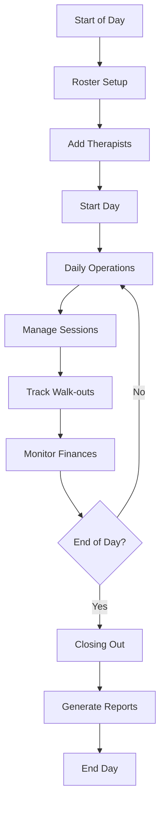

# 👥 User Guide

Comprehensive user guide for the SPA Operations Dashboard, covering all user workflows, features, and best practices.

## 📋 Table of Contents

- [Getting Started](#getting-started)
- [Daily Workflow](#daily-workflow)
- [Roster Management](#roster-management)
- [Session Management](#session-management)
- [Dashboard Operations](#dashboard-operations)
- [Financial Management](#financial-management)
- [Closing Out](#closing-out)
- [Troubleshooting](#troubleshooting)
- [Tips & Best Practices](#tips--best-practices)

## 🚀 Getting Started

### First Time Setup

1. **Access the Application**
   - Open your web browser
   - Navigate to the SPA Operations Dashboard URL
   - You'll see the login screen

2. **Login**
   - Use your provided credentials
   - Test credentials: `admin@spa.com` / `test123`
   - Click "Sign In" to access the dashboard

3. **Initial Configuration**
   - The system will guide you through initial setup
   - Verify your therapist and room data
   - Review service packages and pricing

### Understanding the Interface

The dashboard uses a **dark terminal-inspired theme** for professional spa operations:

- **Header** - Shows current date/time and navigation
- **Main Area** - Current workflow (roster setup, dashboard, closing out)
- **Side Panel** - Additional tools and information
- **Status Indicators** - Real-time updates and notifications

## 📅 Daily Workflow

### Complete Daily Process



### 1. **Morning Setup (Roster Setup)**

#### Adding Therapists to Roster

1. **Navigate to Roster Setup**
   - If not already there, click "Roster Setup" button
   - You'll see the roster setup interface

2. **Search and Add Therapists**
   - Type in the search box to find therapists
   - Click on therapist names to add them to today's roster
   - See roster count update in real-time

3. **Verify Roster**
   - Check that all expected therapists are added
   - Review the "Today's Roster" count
   - Ensure roster matches your schedule

4. **Start the Day**
   - Click "Start Day" button when ready
   - System will transition to the main dashboard
   - All therapists will show as "Available"

### 2. **Daily Operations (Main Dashboard)**

#### Dashboard Overview

The main dashboard provides real-time visibility into:

- **Therapist Status** - Available, In Session, Departed
- **Room Availability** - Available, Occupied
- **Active Sessions** - Currently running sessions
- **Financial Metrics** - Revenue, payouts, expenses
- **Walk-out Tracking** - Customer no-shows

#### Key Dashboard Features

**Real-time Statistics**
- Total Slips (completed sessions)
- Total Revenue (customer payments)
- Total Payouts (therapist earnings)
- Total Discounts (applied discounts)
- Total Expenses (therapist expenses)
- Shop Revenue (product sales)

**Navigation Controls**
- **Roster Setup** - Return to roster management
- **Summary** - Go to closing out
- **Undo** - Reverse last action (with warnings)

### 3. **End of Day (Closing Out)**

#### Daily Summary and Reporting

1. **Navigate to Closing Out**
   - Click "Summary" button from dashboard
   - System shows comprehensive daily summary

2. **Review Daily Statistics**
   - Total sessions completed
   - Revenue breakdown
   - Therapist payouts
   - Expense summaries
   - Walk-out statistics

3. **Generate Reports**
   - Export data to CSV
   - Print daily summary
   - Review session history

4. **End the Day**
   - Click "End Day" when all operations complete
   - System archives daily data
   - Ready for next day setup

## 👥 Roster Management

### Adding Therapists

#### Method 1: Search and Add
1. **Use Search Function**
   - Type therapist name in search box
   - System shows matching results
   - Click on therapist to add to roster

2. **Search Tips**
   - Type at least 1 letter to see results
   - Search is case-insensitive
   - Partial matches work (e.g., "Al" finds "Alice")

#### Method 2: Quick Add
- Some interfaces may have quick-add buttons
- Click to instantly add common therapists

### Managing Roster

#### Removing Therapists
1. **Clear Individual Therapists**
   - Click therapist name in roster list
   - Select "Remove from Roster"

2. **Clear Entire Roster**
   - Click "All Clear" button
   - Confirm action in dialog
   - All therapists removed from roster

#### Roster Validation
- System prevents starting day with empty roster
- Minimum roster requirements can be configured
- Validation messages guide proper setup

### Roster Statistics

**Global Roster** - Total therapists in system
**Today's Roster** - Therapists scheduled for today
**Available Count** - Currently available therapists
**In Session Count** - Therapists with active sessions

## 🎯 Session Management

### Creating Sessions

#### Step 1: Initiate Session Creation
1. **From Dashboard**
   - Click on therapist card
   - Click "New Session" button
   - Session modal opens

2. **From Side Panel**
   - Use "Quick Session" tools
   - Pre-filled with common options

#### Step 2: Service Selection
1. **Choose Service Category**
   - **Single** - One therapist sessions
   - **Double** - Two therapist sessions
   - **Couple** - Couple massage sessions

2. **Select Service Package**
   - **60 minutes** - Standard session
   - **90 minutes** - Extended session
   - **120 minutes** - Premium session
   - Custom durations available

3. **Review Pricing**
   - Service price displayed
   - Therapist payout shown
   - Shop revenue included

#### Step 3: Room Assignment
1. **View Available Rooms**
   - Green buttons = Available
   - Red buttons = Occupied
   - Room capacity shown

2. **Select Room**
   - Click on available room
   - Room becomes selected
   - Other rooms remain available

#### Step 4: Additional Options
1. **Second Therapist** (for double/couple sessions)
   - Select from available therapists
   - System shows compatibility

2. **Apply Discounts**
   - Enter discount amount
   - System validates discount limits
   - Final price calculated

#### Step 5: Confirm Session
1. **Review Session Details**
   - Service type and duration
   - Assigned therapists
   - Selected room
   - Final pricing

2. **Start Session**
   - Click "Confirm" or "Start Session"
   - Session becomes active
   - Timer begins counting

### Managing Active Sessions

#### Session Monitoring
- **Active Sessions Panel** - Shows all running sessions
- **Timer Display** - Real-time session duration
- **Therapist Status** - Shows "In Session" status
- **Room Status** - Shows "Occupied" status

#### Session Actions
1. **Complete Session**
   - Click "Complete" button
   - Session ends and moves to history
   - Therapist becomes available
   - Room becomes available

2. **Handle Walk-outs**
   - Click "Walk Out" button
   - Select reason from dropdown
   - Enter additional details if needed
   - Session marked as walk-out

3. **Session Extensions**
   - Click "Extend" button
   - Add additional time
   - Update pricing if needed

### Session History

#### Viewing Completed Sessions
1. **From Dashboard**
   - Scroll to "Recent Sessions"
   - View completed sessions

2. **From Closing Out**
   - Complete session history
   - Detailed session information
   - Edit capabilities

#### Editing Sessions
1. **Access Edit Mode**
   - Click "Edit" on completed session
   - Edit modal opens

2. **Modify Session Details**
   - Change service type
   - Adjust pricing
   - Update therapist assignments
   - Modify timing

3. **Save Changes**
   - Click "Save" to confirm
   - System recalculates totals
   - Changes reflected in reports

## 💰 Financial Management

### Revenue Tracking

#### Session Revenue
- **Customer Payments** - Amount paid by customers
- **Discounts Applied** - Total discounts given
- **Net Revenue** - Actual revenue received

#### Shop Revenue
- **Product Sales** - Items sold to customers
- **Therapist Purchases** - Items bought by staff
- **Total Shop Revenue** - Combined product sales

### Expense Management

#### Therapist Expenses
1. **Add Expenses**
   - Click "Expenses" button
   - Enter expense amount
   - Add description/category
   - Assign to specific therapist

2. **Expense Categories**
   - **Supplies** - Massage oils, lotions
   - **Equipment** - Tools and accessories
   - **Training** - Education and certification
   - **Other** - Miscellaneous expenses

#### Expense Tracking
- **Individual Expenses** - Per-therapist tracking
- **Daily Totals** - Combined daily expenses
- **Category Breakdown** - Expense type analysis

### Payout Calculations

#### Automatic Calculations
- **Service Payouts** - Fixed amounts per service
- **Expense Deductions** - Expenses subtracted from payouts
- **Net Payout** - Final amount to therapist

#### Payout Formula
```
Net Payout = Service Payout - Therapist Expenses
```

#### Payout Management
1. **Review Payouts**
   - View individual therapist payouts
   - Check expense deductions
   - Verify final amounts

2. **Payout Reports**
   - Daily payout summary
   - Individual therapist breakdown
   - Expense detail reports

## 📊 Dashboard Operations

### Real-time Monitoring

#### Therapist Status Management
1. **Check-in/Check-out**
   - Click therapist status button
   - Update availability status
   - Track working hours

2. **Status Types**
   - **Available** - Ready for sessions
   - **In Session** - Currently with customer
   - **Departed** - Left for the day

#### Room Management
1. **Room Status Updates**
   - Rooms auto-update with sessions
   - Manual status changes available
   - Room utilization tracking

2. **Room Types**
   - **Shower Rooms** - Standard massage rooms
   - **VIP Rooms** - Premium service rooms
   - **Jacuzzi Rooms** - Special amenity rooms

### Side Panel Tools

#### Walk-out Management
1. **Add Walk-outs**
   - Enter walk-out count
   - Select reason from dropdown
   - Track by reason category

2. **Walk-out Reasons**
   - **No Rooms** - No available rooms
   - **Customer Left** - Customer departed
   - **Emergency** - Emergency situation
   - **Technical Issue** - System problems

#### Quick Actions
- **Undo Last Action** - Reverse previous operation
- **Export Data** - Download current data
- **Print Receipts** - Reprint session receipts
- **Emergency Stop** - Halt all operations

### Navigation

#### Phase Navigation
1. **Roster Setup** - Return to morning setup
2. **Dashboard** - Main operations view
3. **Summary** - End-of-day closing

#### Quick Access
- **User Menu** - Account and logout
- **Debug Tools** - Technical information
- **Help** - Access documentation

## 🏁 Closing Out

### Daily Summary

#### Financial Overview
1. **Revenue Summary**
   - Total session revenue
   - Shop revenue breakdown
   - Discount totals
   - Net revenue calculation

2. **Expense Summary**
   - Therapist expenses
   - Category breakdown
   - Daily expense total

3. **Payout Summary**
   - Individual therapist payouts
   - Total payout amount
   - Expense deductions

#### Session Summary
1. **Session Statistics**
   - Total sessions completed
   - Average session duration
   - Session type breakdown
   - Room utilization

2. **Walk-out Statistics**
   - Total walk-outs
   - Reason breakdown
   - Walk-out rate

### Data Export

#### Export Options
1. **CSV Export**
   - Session data export
   - Financial data export
   - Therapist data export
   - Custom date ranges

2. **Print Options**
   - Daily summary report
   - Individual session receipts
   - Financial summary
   - Therapist payout reports

### End of Day Process

#### Final Steps
1. **Review All Data**
   - Verify session accuracy
   - Check financial totals
   - Confirm therapist payouts

2. **Generate Final Reports**
   - Create daily summary
   - Export data for accounting
   - Print required documents

3. **End Day**
   - Click "End Day" button
   - Confirm action
   - System archives data
   - Ready for next day

## 🔧 Troubleshooting

### Common Issues

#### Session Creation Problems
**Issue**: Can't create session
**Solutions**:
- Verify therapist is available
- Check room availability
- Ensure valid service selection
- Try refreshing the page

#### Login Issues
**Issue**: Can't log in
**Solutions**:
- Check username/password
- Verify internet connection
- Clear browser cache
- Contact administrator

#### Data Not Saving
**Issue**: Changes not persisting
**Solutions**:
- Check internet connection
- Verify database connection
- Try refreshing the page
- Check for error messages

#### Performance Issues
**Issue**: Slow loading or freezing
**Solutions**:
- Refresh the browser
- Clear browser cache
- Check internet speed
- Close other browser tabs

### Error Messages

#### Common Error Messages
1. **"Session creation failed"**
   - Check all required fields
   - Verify room availability
   - Try again in a moment

2. **"Network error"**
   - Check internet connection
   - Refresh the page
   - Contact technical support

3. **"Authentication required"**
   - Log out and log back in
   - Check session timeout
   - Clear browser cookies

### Getting Help

#### Self-Help Resources
1. **Documentation** - This user guide
2. **Help Tooltips** - Hover over icons for tips
3. **Error Messages** - Read error descriptions

#### Contact Support
1. **Technical Issues** - Contact IT support
2. **Training Questions** - Contact supervisor
3. **System Problems** - Contact administrator

## 💡 Tips & Best Practices

### Daily Operations

#### Morning Setup
- **Prepare Early** - Set up roster before first appointments
- **Verify Data** - Double-check therapist availability
- **Review Schedule** - Confirm room assignments

#### During Operations
- **Monitor Actively** - Watch for session updates
- **Handle Issues Quickly** - Address problems immediately
- **Keep Records** - Track all walk-outs and issues

#### End of Day
- **Complete Thoroughly** - Don't rush closing out
- **Verify Accuracy** - Double-check all numbers
- **Backup Data** - Export important information

### Efficiency Tips

#### Keyboard Shortcuts
- **Tab** - Navigate between fields
- **Enter** - Confirm actions
- **Escape** - Cancel or close modals
- **Ctrl+Z** - Undo last action (where available)

#### Workflow Optimization
1. **Batch Operations** - Group similar tasks
2. **Use Templates** - Save common configurations
3. **Quick Actions** - Use side panel tools
4. **Keyboard Navigation** - Learn keyboard shortcuts

### Data Management

#### Accuracy
- **Double-Check Input** - Verify all data entry
- **Regular Backups** - Export data frequently
- **Monitor Trends** - Watch for unusual patterns

#### Security
- **Logout Properly** - Always log out when done
- **Protect Credentials** - Don't share login information
- **Report Issues** - Alert to security concerns

### Best Practices Summary

1. **Start Early** - Begin setup before appointments
2. **Stay Organized** - Keep workspace clean and organized
3. **Monitor Continuously** - Watch dashboard for updates
4. **Document Issues** - Record problems and solutions
5. **End Properly** - Complete closing out thoroughly
6. **Backup Regularly** - Export data for safekeeping
7. **Stay Updated** - Learn new features and improvements

---

**Need More Help?** Check the [FAQ](FAQ.md) or contact your system administrator for additional support.
